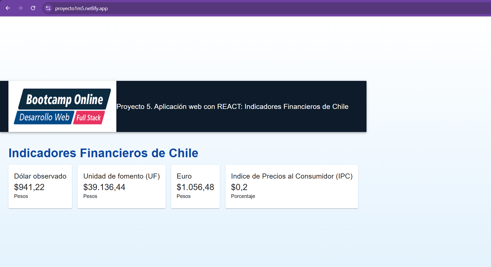

# 📊 Indicadores Financieros de Chile

Este proyecto es una aplicación web desarrollada con **React + Vite** que permite visualizar los principales indicadores económicos de Chile (como el dólar, IPC, UF, euro, entre otros), consumiendo datos en tiempo real desde la API pública de [https://mindicador.cl](https://mindicador.cl).

## 🚀 Funcionalidades

- Conexión a API pública chilena de indicadores
- Visualización de datos históricos en gráficos interactivos
- Filtro por **rango de fechas personalizado** usando calendarios
- Tabla sincronizada con el gráfico
- Diseño responsivo y profesional usando **MUI**
- Manejo de errores con `ErrorBoundary`
- Navegación entre páginas con React Router

## 🛠 Tecnologías utilizadas

- [React](https://reactjs.org/)
- [Vite](https://vitejs.dev/)
- [React Router](https://reactrouter.com/)
- [MUI (Material UI)](https://mui.com/)
- [Recharts](https://recharts.org/)
- [Day.js](https://day.js.org/)
- [Git + GitHub](https://github.com/)
- [Netlify](https://www.netlify.com/) *(para despliegue)*

## 📷 Captura de pantalla

 

## 🔧 Instalación local

1. Clona este repositorio:

```bash
git clone https://github.com/Nico-MDS/PROYECTO1M5.git

## 🌐 Sitio en producción

🔗 https://proyecto1m5.netlify.app

## ✅ Cumplimiento de requisitos mínimos
Este proyecto cumple con todos los requisitos establecidos para la evaluación:

## 🧠 REACT
✅ Uso de Vite para la generación del proyecto

✅ Creación de componentes funcionales

✅ Conexión a una API pública y visualización de datos (https://mindicador.cl/api)

✅ Uso de Hooks como useEffect y useState para manejo asincrónico

✅ Implementación de rutas con React Router (/ e /detalle/:tipo)

✅ Manejo de errores con un Error Boundary

✅ Estilizado completo con el framework MUI (Material UI)

## 🔁 Control de versiones
✅ Proyecto alojado en GitHub: https://github.com/Nico-MDS/PROYECTO1M5

✅ Mínimo 5 commits realizados en el repositorio

✅ Archivo README.md completo con descripción, instrucciones de instalación y uso

## 🌐 Despliegue
✅ Proyecto desplegado en producción con Netlify
🔗 https://proyecto1m5.netlify.app


